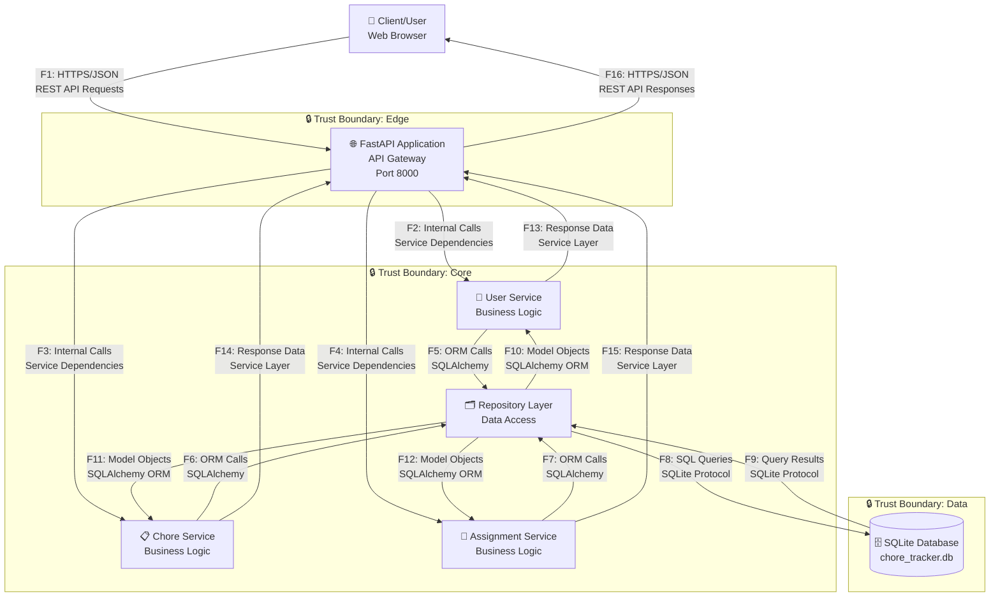

# DFD — Data Flow Diagram для Chore Tracker API

## Диаграмма (Mermaid)

## Список потоков
| ID | Откуда → Куда | Канал/Протокол | Данные/PII | Комментарий |
|----|---------------|-----------------|------------|-------------|
| F1 | Client → API | HTTPS/JSON | User credentials, chore data, assignment data | REST API requests (GET, POST, PUT, DELETE) |
| F2 | API → UserService | Internal function calls | User data, email, name | Service dependency injection |
| F3 | API → ChoreService | Internal function calls | Chore data, title, cadence | Service dependency injection |
| F4 | API → AssignmentService | Internal function calls | Assignment data, user_id, chore_id, due_at | Service dependency injection |
| F5 | UserService → Repositories | ORM calls (SQLAlchemy) | User entity data | Database access layer |
| F6 | ChoreService → Repositories | ORM calls (SQLAlchemy) | Chore entity data | Database access layer |
| F7 | AssignmentService → Repositories | ORM calls (SQLAlchemy) | Assignment entity data | Database access layer |
| F8 | Repositories → Database | SQLite protocol | SQL queries, user PII, chore data, assignments | Direct database queries |
| F9 | Database → Repositories | SQLite protocol | Query results, user records, chore records, assignment records | Database response data |
| F10 | Repositories → UserService | ORM objects (SQLAlchemy) | User model objects | Data model transformation |
| F11 | Repositories → ChoreService | ORM objects (SQLAlchemy) | Chore model objects | Data model transformation |
| F12 | Repositories → AssignmentService | ORM objects (SQLAlchemy) | Assignment model objects | Data model transformation |
| F13 | UserService → API | Service layer responses | User response data | Business logic results |
| F14 | ChoreService → API | Service layer responses | Chore response data | Business logic results |
| F15 | AssignmentService → API | Service layer responses | Assignment response data | Business logic results |
| F16 | API → Client | HTTPS/JSON | API responses, user data, statistics | REST API responses |

## Описание компонентов

### Внешние участники
- **Client**: Веб-браузер, отправляющее HTTP запросы к API

### Edge Trust Boundary
- **FastAPI Application**: API Gateway, обрабатывающий HTTP запросы, валидацию данных, маршрутизацию

### Core Trust Boundary
- **User Service**: Бизнес-логика для управления пользователями
- **Chore Service**: Бизнес-логика для управления задачами
- **Assignment Service**: Бизнес-логика для управления назначениями
- **Repository Layer**: Слой доступа к данным

### Data Trust Boundary
- **SQLite Database**: Хранилище данных с пользователями, задачами и назначениями
